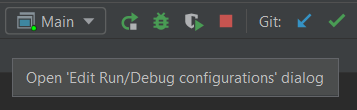
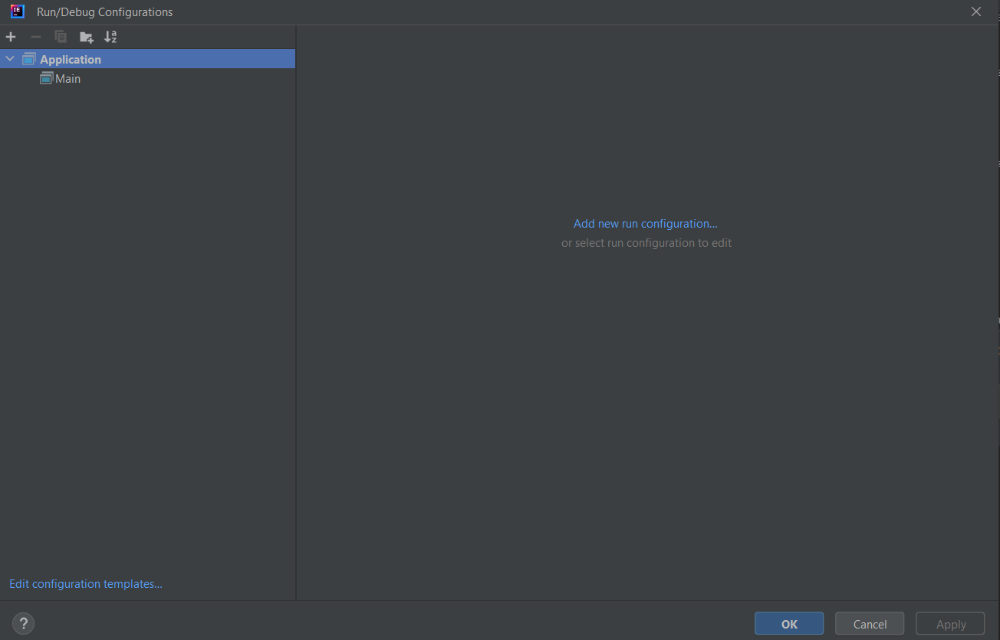
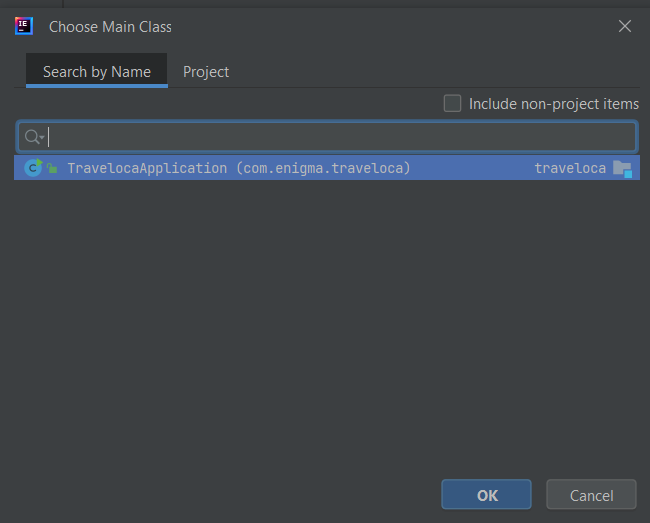
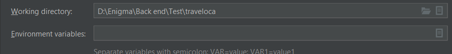

# Traveloca

## Overview

Welcome to the Traveloca API project! This API allows you to manage flight ticket order transactions and related entities.

## Table of Contents

- [Features](#features)
- [Installation](#installation)
- [Usage](#usage)
- [Contributing](#contributing)
- [License](#license)

## Features

List the key features of traveloca. For example:

- User authentication and authorization (admin and customer)
- Security bearer authentication for all api except authentication
- Flight catalog
- Transaction
- Find, delete, and update for every table except transaction and transaction detail

## Installation
Reload the maven pom.xml (in traveloca package intellij), here are the steps:
- Right-click the pom.xml
- Hover to maven
- Click reload project
- Wait until the download is complete.

## Usage
Steps to run the application(intellij):
- Click Open 'Edit Run/Debug configurations' dialog. In image below click the 'Main' 
- Click Edit Configurations
- Click Add new configuration. If there is none then click Application and click Add new configuration(see image) 
- Select Main Class to run 
- Click ok 
- Set the environment variables 
- Here is the template 
DB_USERNAME=your_database_username;DB_PASSWORD=your_database_password;JWT_SECRET=up_to_you
- After that just Click ok then run the application
- If the app is running successfully open the documentation to freely use the app [Documentation](http://localhost:8080/swagger-ui/index.html)
- You need to register and login as an admin to access all the features
- You have limited access if you log as a customer

## Contributing

We welcome contributions from the community. If you find a bug or have a feature request, please open an issue. If you'd like to contribute code, please fork the repository and submit a pull request.

## License

This project is licensed under the MIT License - see the [LICENSE](LICENSE) file for details.

